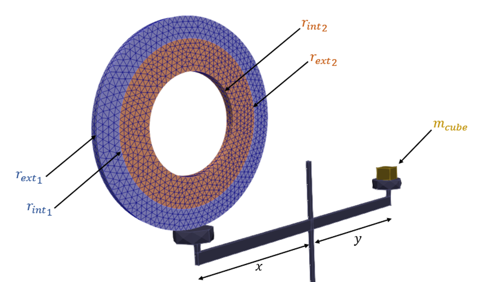
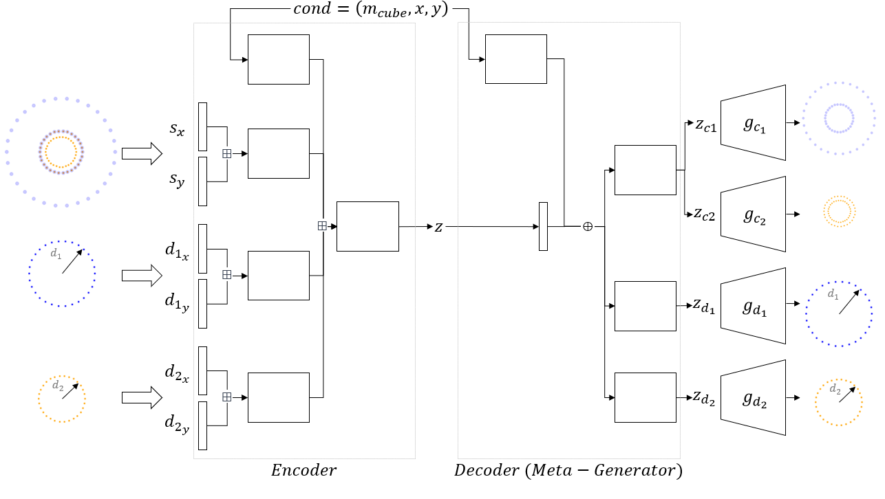

# A Meta-Generation Framework for Industrial System Generation

This repository contains the implementation of the Meta-VAE architecture and the MCB Design dataset introduced in the paper "A Meta-VAE for Multi-Component Industrial Systems Generation".

## Overview

Industrial systems often consist of multiple components connected by complex design constraints. Traditional Deep Generative Models (DGMs) struggle to generate such multi-component systems while respecting these latent constraints. This work addresses two key challenges:

1. **The Meta-VAE Architecture**: A novel generative model that uses pretrained marginal generators coordinated by a meta-generator to jointly produce system components that satisfy design constraints
2. **MCB Design Dataset**: An industry-inspired benchmark dataset for evaluating generative models on constrained multi-component system generation


*Figure 1: The MCB Design use case - a simplified industrial system with two nested cylinders in equilibrium with a reference mass*


*Figure 2: The Meta-VAE architecture applied to MCB Design, showing marginal generators and the meta-generator coordination*

## Key Features

### Meta-VAE Architecture
- Separates the generation task into marginal and joint generation
- Uses pretrained VAEs as marginal generators for individual components
- Meta-generator coordinates the marginal generators to ensure constraint satisfaction
- Outperforms vanilla VAE and GAN models on constraint enforcement and generation quality

### MCB Design Dataset
- Memory-efficient representation using point clouds
- Two evaluation metrics: contact constraint error and equilibrium performance measure
- Controllable complexity for systematic benchmarking
- 20,000 training samples with configurable generation parameters

## Repository Structure

```
├── src/
│   ├── dataset/          # Dataset generation and loading utilities
│   └── models/           # Model architectures
│       ├── marginals/    # Marginal VAE implementations
│       │   └── vae.py
│       ├── meta/         # Meta-VAE and baseline architectures
│       ├── blocks.py     # Base building blocks for models
│       └── early_stoppers.py
├── saved_models/         # Pretrained models (5 instances per architecture)
│   ├── meta_vae/
│   ├── vanilla_vae/
│   ├── vanilla_gan/
│   └── smvae/
├── notebooks/           # Jupyter notebooks for experiments
│   ├── dataset_generation.ipynb  # Generate MCB Design dataset
│   ├── experiments.ipynb         # Evaluate models and visualize results
│   └── train_models.ipynb       # Train model instances
└── figures/             # Figures for documentation
```

## Getting Started

### Prerequisites

- Python 3.7+
- CUDA-capable GPU (recommended for training)

### Installation

1. Clone the repository:
```bash
git clone https://github.com/HiddenContributor/A_Meta_Generation_framework_for_Industrial_System_Generation.git
cd A_Meta_Generation_framework_for_Industrial_System_Generation
```

2. Create a virtual environment and install dependencies:
```bash
python -m venv venv
source venv/bin/activate  # On Windows: venv\Scripts\activate
pip install -r requirements.txt
```

### Usage

#### Generate the Dataset
```bash
jupyter notebook notebooks/dataset_generation.ipynb
```
This creates the MCB Design dataset with configurable parameters for cylinder radii, densities, and equilibrium conditions.

#### Train Models
```bash
jupyter notebook notebooks/train_models.ipynb
```
Trains 5 instances of each model architecture (Meta-VAE, SMVAE, Vanilla VAE, Vanilla GAN) for robust evaluation.

#### Run Experiments
```bash
jupyter notebook notebooks/experiments.ipynb
```
- Visualize generated systems and their distributions
- Compare model performance on constraint satisfaction
- Generate systems conditionally given specific design requirements (mcube, x, y)
- Analyze Wasserstein distances between real and generated distributions

## Evaluation Metrics

The framework provides two key metrics for evaluating generated systems:

1. **Contact Constraint Error (Ec)**: Measures adherence to the physical contact requirement between nested cylinders
2. **Performance Measure (Ep)**: Quantifies the equilibrium equation satisfaction for the system balance

## Results Summary

Based on experiments with the MCB Design dataset:

- Meta-VAE achieves the best performance in enforcing both equilibrium and contact constraints
- Generated systems from Meta-VAE show higher variability while maintaining constraint satisfaction
- The architecture effectively separates marginal component generation from joint distribution learning

## Dependencies

```
numpy==1.24.2
pandas==1.5.3
torch==1.13.1
tqdm==4.65.0
matplotlib==3.7.1
scipy==1.10.0
```

## Citation

If you use this code or dataset in your research, please cite:

```bibtex
@InProceedings{10.1007/978-3-031-62281-6_17,
  author="Oubari, Fouad and Meunier, Raphael and D{\'e}catoire, Rodrigue and Mougeot, Mathilde",
  editor="Arai, Kohei",
  title="A Meta-VAE for Multi-component Industrial Systems Generation",
  booktitle="Intelligent Computing",
  year="2024",
  publisher="Springer Nature Switzerland",
  address="Cham",
  pages="234--251",
  isbn="978-3-031-62281-6"
}
```

## License

This project is licensed under a Non-Commercial License. You may use, distribute, and modify this code for non-commercial academic and research purposes only. Commercial use is strictly prohibited without prior written permission from the authors.

For commercial inquiries, please contact the authors through the repository.

## Acknowledgments

This work was conducted at Université Paris-Saclay, CNRS, ENS Paris-Saclay, Centre Borelli in collaboration with Manufacture Française des Pneumatiques Michelin.